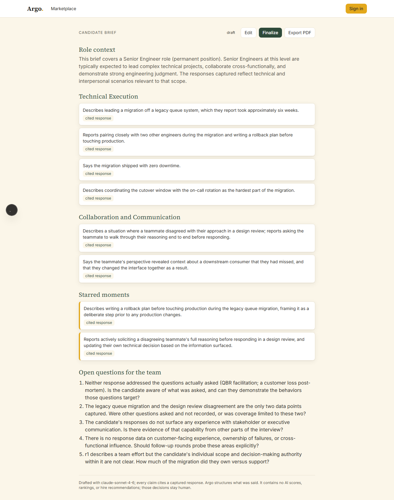
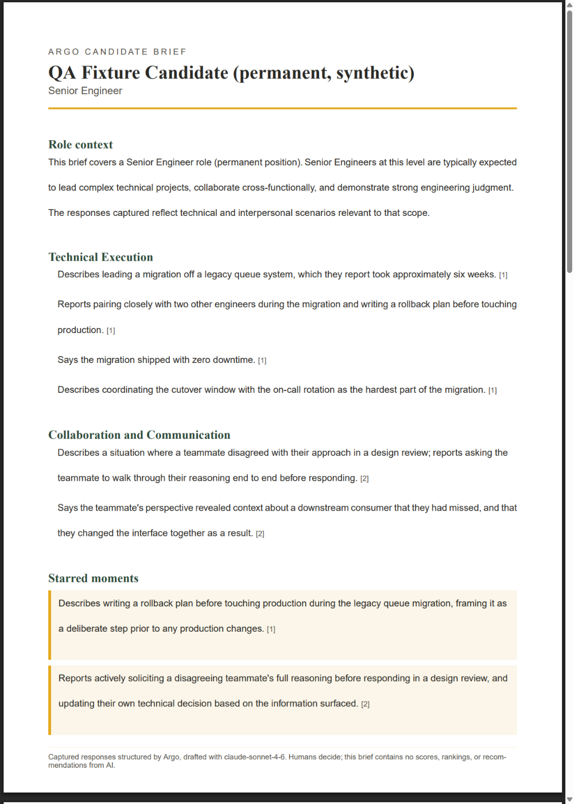

# PDF Visual Check, 2026-07-12

Closes Goal 2 could-not-verify item 3 (PDF visual parity) as far as an
agent can close it: this presents the comparison for Mo's own eyes. The
visual match/mismatch call is not made here, per instruction.

## Fixture

A permanent, reusable QA fixture, authorized by Mo specifically so future
PDF and visual checks never need to touch another account's data:

- **Brief ID:** `e0de276f-487d-4b5c-a821-41a8d271906e`
- **Owner:** the dev account (`DEV_SIGNIN_EMAIL` in `.env.local`)
- **QStack:** "PDF visual check fixture (permanent QA fixture)" — built
  from two existing seeded bank questions (no new questions authored, no
  classifier calls)
- **Interview:** candidate name "QA Fixture Candidate (permanent,
  synthetic)" — synthetic, not a real person
- **Path to create it:** consent gate passed through the real UI (both
  parties checked, confirm clicked), two responses typed into the real
  response field and scored through the real scoring control, session
  ended through the real end-session control, brief generated through
  the real "Generate candidate brief" action
- **Brief generation call:** one real `claude-sonnet-4-6` call through
  the standard production transport, logged to hosted `ai_calls` with
  normal cost accounting — `purpose: brief_drafting`, `tokens_in: 676`,
  `tokens_out: 697`, `cost_usd: 0.012483`

This QStack, interview, session, and brief are left in place on the
hosted project as a standing fixture; nothing about this run is
disposable except the capture scripts themselves (already deleted).

## Web view

Full-page screenshot of `http://localhost:3000/briefs/e0de276f-487d-4b5c-a821-41a8d271906e`,
signed in as the dev account (same session that generated the brief).

## PDF export, page 1 of 3

Rendered from the real PDF returned by `GET /api/briefs/[id]/pdf`
(fetched in the same authenticated browser session, not a separate
generation path). The full 3-page PDF is saved alongside this doc at
`docs/qa/assets/pdf-visual-check-brief.pdf`; page 1 is rendered to PNG
below for a direct side-by-side look. Page 1 covers role context,
Technical Execution, Collaboration and Communication, and Starred
moments; page 2 (not shown) continues into Open questions for the team.

## Assets

| File | What it is |
| --- | --- |
| `assets/pdf-visual-check-web.png` | Full-page screenshot, web brief view |
| `assets/pdf-visual-check-pdf-page1.png` | Rendered PNG of PDF page 1 |
| `assets/pdf-visual-check-brief.pdf` | The raw PDF export, all 3 pages |

## Not judged here

Whether the PDF matches the web view closely enough to consider Goal 2
could-not-verify item 3 resolved is Mo's call, per the goal statement
("Do not mark this item done... Mo makes the actual call"). No pass/fail
verdict is recorded in this document or in the build log's Part 2
section.
